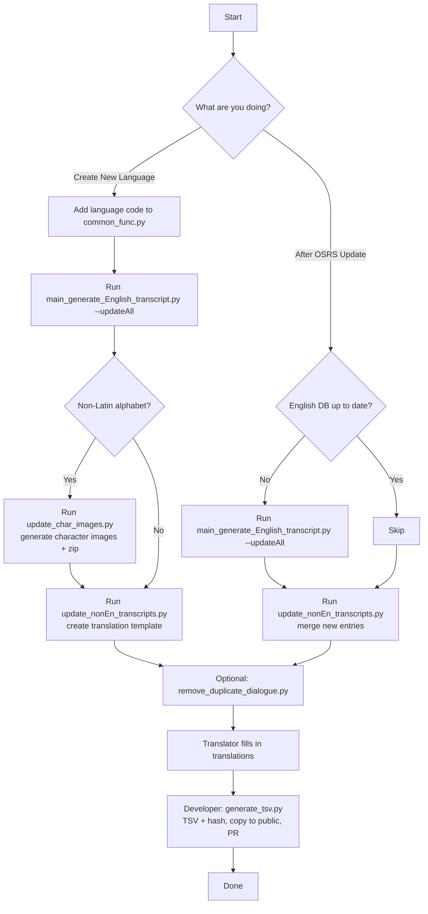

# RuneLingual Transcript Updater

Welcome to the updater directory of the RuneLingual Transcript Sources. This directory contains scripts and utilities to update and maintain the transcripts used by the RuneLingual plugin.

## Overview of Updater Programs

The `Updater` directory contains five distinct programs, each designed to perform specific tasks for maintaining and updating transcripts. Below is a detailed description of each program's functionality:

1. [`main_generate_English_transcript.py`](update_english_transcript/main_generate_English_transcript.py): This program is responsible for updating the English transcript from the source. Read the [explanation](update_english_transcript/readme.md) for more detail.

2. [`update_nonEn_transcripts.py`](./update_nonEn_transcripts.py): This program reads data from the [English transcript database](transcript.db), and updates all other language's translation file (either excel or xliff) transcript to include records that are not included in those files. If a translation file doesn't exist, it will create a copy of the English transcript, and add a column for translation. The output files will be found in [draft folder](../draft/). These files should be downloaded and translated.

3. [`update_char_images.py`](./update_char_images.py): This program creates character images for insertion like emojis in the RuneLite client. This is used for languages whose alphabets is not supported by OSRS client such as Japanese, and not necessary for many European langauges.

4. [`generate_tsv.py`](./generate_tsv.py): This program processes the  translated transcripts (generated by [update_nonEn_transcripts.py](./update_nonEn_transcripts.py) then translated by a translator), and convert them into TSV (Tab-Separated Values) format. These TSV files will also be found in [draft folder](../draft/), and should be reviewed and then moved to the [public](../public/) directory for use by the plugin.


For a deeper understanding of why these scripts are essential, please refer to the [README](./RuneLingual/transcript/README.md) in the top directory.




## Create a Transcript for New Language

You can ask someone in the [Discord](#lets-chat) below to do it for you, but if you want to do it yourself:
1. Add the language's code to necessary files, such as [LANG and LANG_CODE_STANDARD in common_func.py](./common_func.py)
2. Clone this repository, and install python to your system. (ask Chat-GPT for mor info, it's very informative!)
3. Run programs 1 and 2 above in [`Overview of Updater Programs`](#overview-of-updater-programs) section.
4. For non-Latin languages, run program 3 above in [`Overview of Updater Programs`](#overview-of-updater-programs) section. But it is likely that program 3 only supports few languages. Contact a developer from the [Discord](#lets-chat) link below for help.

For languages such as Japanese, Russian, Program 3 [update_char_images.py](./update_char_images.py) must be configured and ran. If you're unsure, ask one of our developers and we'll be able to test it for you.

Program 3 [update_char_images.py](./update_char_images.py) is unnecessary if the language uses the English alphabet, including characters with accents (like those in Spanish, Portuguese, Norwegian). 

## How to Update Foriegn Transcripts After an OSRS Update
1. Clone this repository, and install python to your system. (ask Chat-GPT for mor info, it's very informative!)
2. Run program [1](update_english_transcript/main_generate_English_transcript.py) and [2](./update_nonEn_transcripts.py).

If the English transcript is already up to date, program 1 does not need to be ran.

## What to Do after Obtaining a Transcript
After cloning this repository and executing some codes, there should be a transcript inside the [draft folder](../draft/).

The transcript file will be in either Excel or ".xliff" format. 

For Excel, You can simply start adding translations in the translation column.

The .xliff file is supported by many CAT softwares, including the free OmegaT.

After you've made progress with translation and want to update the plugin, you can either send the file to one of the developers in our [Discord server](https://discord.gg/ehwKcVdBGS), or make sure the language's folder in [draft folder](../draft/) and make a pull request to the GitHub repository.

## Developers: after receiving translated transcript
1. Clone the whole repository to your local machine
2. Run ['generate_tsv.py'](./generate_tsv.py). It will turn the Excel or .xliff transcript to TSV, and also automatically update the hash file value.
3. Check inside the target language in [draft folder](../draft/) that there is a TSV version of the newly obtained translation.
4. Copy the TSV version to the language's folder in [public folder](../public/). If it already exists, replace it.
5. Check that no files have been deleted in other languages' folder.
6. After you are sure correct files are in each folder of [public folder](../public/), make a pull request, and have someone accept it.

## Adding/Updating Character images
1. Prepare a file that contains all texts to be displayed in-game, save it as `all_char_??.txt`, where `??` is [the language code](https://developers.deepl.com/docs/resources/supported-languages#target-languages) for your language.
2. Download a font (.ttf format) that is Copy right free, free to use for commercial use, as free from restrictions as possible.
3. Add the file from Step 1 to [char_lists folder](char_lists/), and the font file from Step 2 (.ttf) to the [fonts folder](fonts/), which are both found in the updater folder.
4. If the new language's code isn't added to [common_func](common_func.py)'s `LANG` and `LANG_CODE_STANDARD`, add the [same code](https://developers.deepl.com/docs/resources/supported-languages#target-languages) as in Step 1.
5. In [updatecharimages.py](./update_char_images.py),
    - Add default variables for your language to the end of 
    ``` python
    font_size_lang = {'ja':12, 'ru':9} # max 12
    canvas_size_lang = {'ja':(12,12), 'ru':(11,11)} # canvas size in order of width, height.
    text_pad_lang = {'ja':(0,0), 'ru':(0,0)} # pixels to shift the text, in order of left padding and top padding
    bg_text_pad_lang = {'ja':(1,1), 'ru':(1,1)} # pixels to shift the 'shadow text', in order of left padding and top padding
    # add more languages as needed
    ```
    You can change the size to be more recognizable later, just set the values to something similart to ones that exist already for now.
6. Create the fonts, by running the `update_char_images.py` while in `Runelingual-Transcripts` directory. 
<br>It will prompt you so enter numbers for your desired language and font style. 
<br>The process will take a while, but after it creates hashes, 

7. Check the output folder. The output will be found under [the draft folder](../draft/)/(language_code)/char foler.
<br> You are likely to find that some letters don't fit in the canvas, and some have too much room.
    - Change the vairables you have set in Step 5. Probably the font_size_lang and canvas_size_lang would change, and the latter 2 not.
    - Optimize width of each characters by adding a function to `setGoodFontSize()` like
    ```python
    def setGoodCharWidth(char, lang): # setting width for a specific character. add more languages as needed
        if lang == 'ja':
            return setJaFontSize(char)
        elif lang == 'ru':
            return setRuFontSize(char)
        else:
            return CANV_WIDTH

    def setJaFontSize(char):
        width = CANV_WIDTH
        if char in ('M', 'W'): # these characters wider than normal, so set their width to be wider
            width = math.ceil(CANV_WIDTH*1.02)
        elif char in ('%', '@', 'm', '#'):
            width = CANV_WIDTH
        ...
        return width
    ```
    Here you can set width for each individual characters.
<br>This is necessary because some characters such as `W` and `M` can be wide, while `i`, `l`, `.` are much narrower.
8. Repeat Step 6 and 7 to get a natural looking set of characters.
9. Delete the unzipped `char_??` file, as the plugin only downloads the `char_??.zip` to aquire the character images.
10. Add, commit, push, and make a PR for one of the devs to accept.
11. Once the language is added to the plugin, you'll be able to see the result in-game.
## Contributing

We welcome contributions to improve our updater scripts. If you'd like to contribute, please refer to the main [README.md](../README.md) file for more information.

## Let's Chat!

Need a hand or have a question? Join us on our [Discord server](https://discord.gg/ehwKcVdBGS). We're here to help and love hearing from you!

## License

This project is licensed under the [MIT License](../LICENSE).
